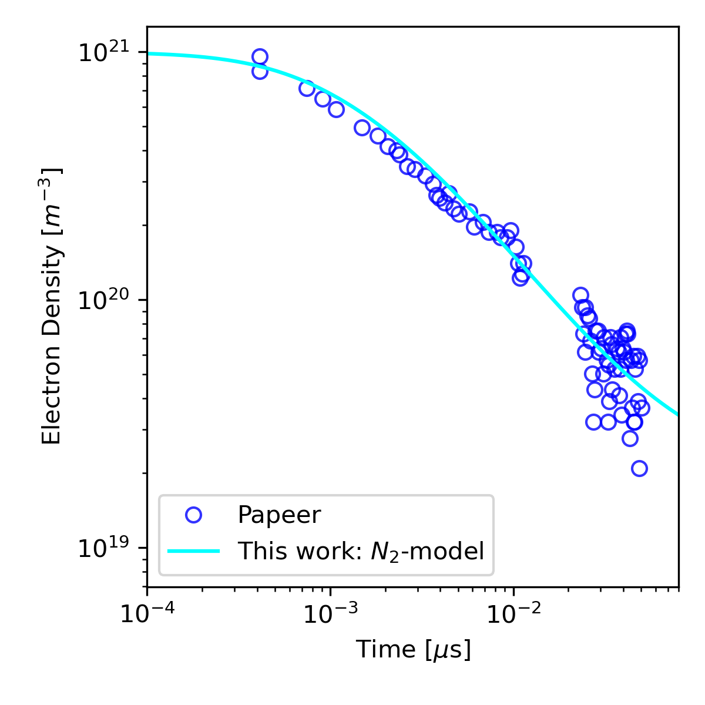

# PLPAK
Package for Low Temperature Plasma Kinetics

PLPAK is a library built for zero-dimensional analysis of plasma-kinetic systems based on provided reaction mechanism set. For non-equilibrium reactions multiple temperatures might be required to specify the rates of reactions and on top of that rate equations for energy exchanges in different modes are also essential. PLPAK is built to streamline the process of building such reaction systems, testing them and solving them.

# Installation
- Clone the repository or download the zip file.
- Add path to the directory containing the package to the environment variable and import.
    ```python
    dir_plpak = os.path.dirname("path_to\PLPAK\src\PLPAK\")
    sys.path.append(dir_plpak)
    import PLPAK as pl
    ```

# **[More Details](./src/readme.md)**
For more details, see the **[src/readme.md](./src/readme.md)**.

## Directory Structure

- `src/` contains the source code for the package.
- `example/` contains examples of how to use the package and relevant .py script to load the library and run the simulations.
- `data/` contains the data files required for the examples. Reaction mechanisms for $N_2$-plasma and experimental data for comparison are included.


### Test
- Run the example/solveWithMech.py to run the simulation and save the data.
- The comparison of simulated results against experiments of Papeer

    

    *Figure: Comparison of Models*
